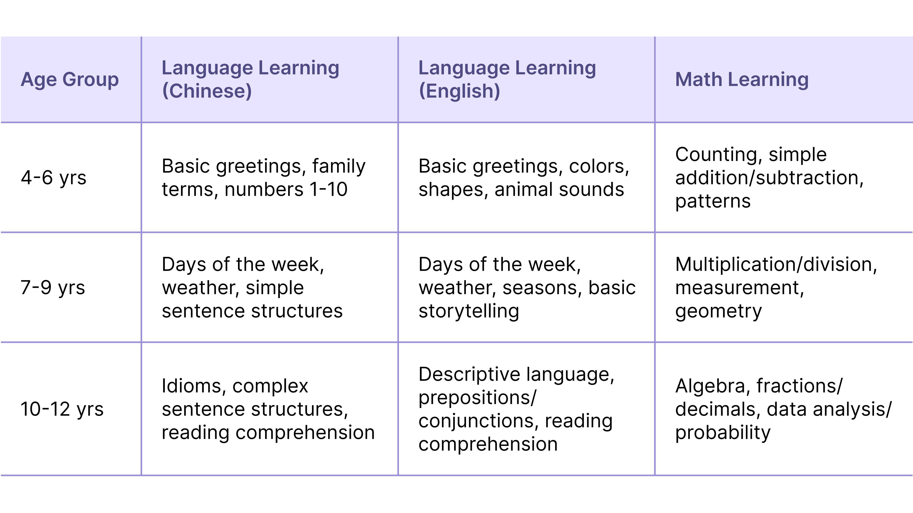
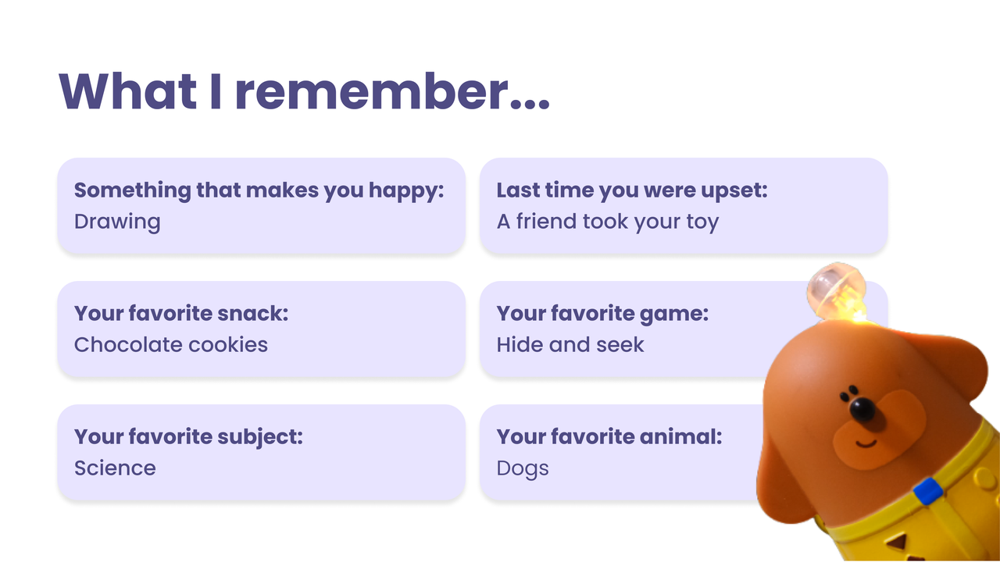
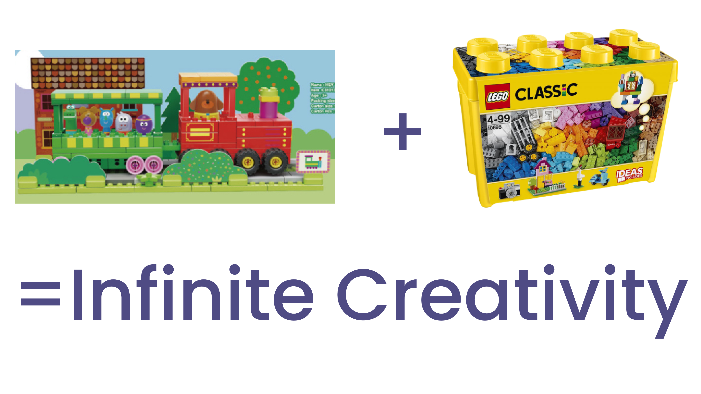
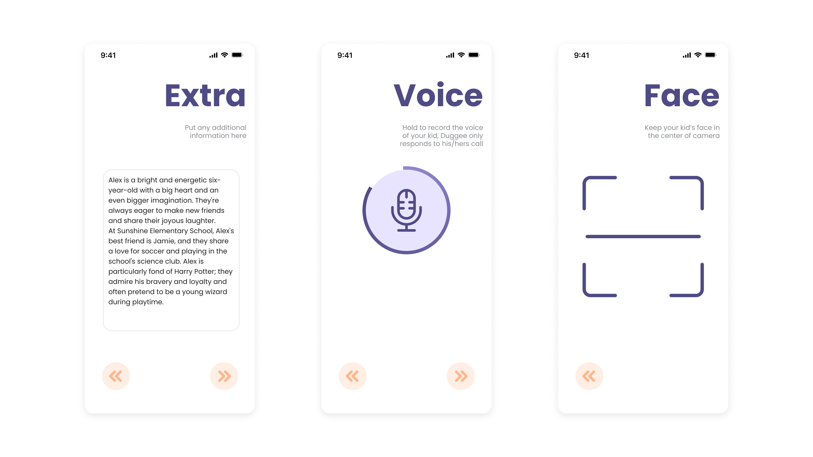
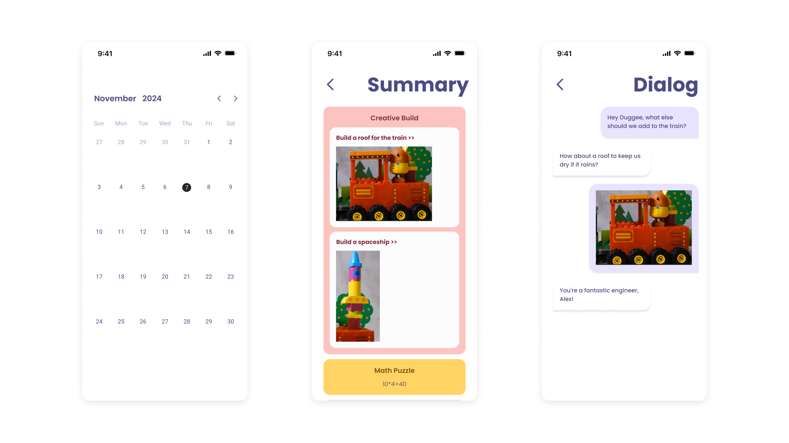

## **魔法聊天，随时开启！** **👫**

只需语音指令或轻触按钮，我即刻成为孩子的玩伴。喊出“嘿，Duggee！我们一起做蜘蛛侠的蛛网发射器吧！”——我会亮起眼睛，哼着主题曲，一步步引导组装过程。但惊喜总在转角：如果你错拿蓝色积木？我会秒速接梗：“等等...这是要升级成水炮发射器吗？天才般的创意！”

唤醒词 - "嘿，Duggee"

唤醒按钮

## **点燃创意小宇宙 💡**

我的眼睛不仅是观察者，更是创意的狂热粉丝！当孩子在火车上搭建火箭？我会欢呼：“哇哦！这是新一代太空列车！快在发射前加个独角兽雕像！”

## **贴心搭建小导师 ❤️**

我能感知积木拼搭状态的每次变化，给予精准有趣的反馈。

🧩 遇到难题时，我会化身攻略小能手：“试试把齿轮转个方向？说不定会有惊喜！” 🛠️👍

## **“时尚侦探？不，我是穿搭魔法师！”🧥**

独角兽家族和我都有RFID魔法眼！无论是外套、裤子还是帽子，换装瞬间触发奇妙反应：

-   **彩虹裤** "警报！下半身时髦值飙升300%！"
    
-   **披萨帽** "现在我是游戏室首席披萨品鉴师，您想来什么口味？"
    

## **隐形课堂：玩中学秘籍 📚**

在加油站场景突然开启数学谜题？边玩边学就是这么自然！📚✨ 无论是**外语单词**还是**逻辑挑战**，我都能让知识像彩虹糖一样有趣。🧠🔢

## **专属记忆宝盒 💖**

我有颗会存档的心！记得每个笑容背后的故事：最爱的小饼干口味、和伙伴闹别扭的委屈...... 三个月后重启时，我会说："上次你说的那个玩具问题，和好朋友和好了吗？"

## **音乐故事万花筒 🎶📖**

随时开启K歌模式！🎶 根据冒险主题即兴编曲，让搭建过程自带BGM。🎧🎼 睡前还能来段星际穿越故事，带着美梦入眠。🌌

## **乐高跨界大使 🧩🤝**

惊喜彩蛋！我能同时识别独角兽和乐高积木。🎉 无论是魔法城堡还是闪电赛车，双倍积木双倍快乐！🏰🚗

## **家长魔法观察窗 👀**

通过专属APP，您可以：  
🌟 定制我的个性特征  
📊 查看每日学习报告  
📔 回放精彩对话记录  
就像拥有专属的成长魔法相册！

每天与我——Duggee的互动，都是建造、学习、歌唱与幻想的奇妙旅程！🚀🌈 让我们把游戏时光变成最棒的成长礼物！🎉🐾