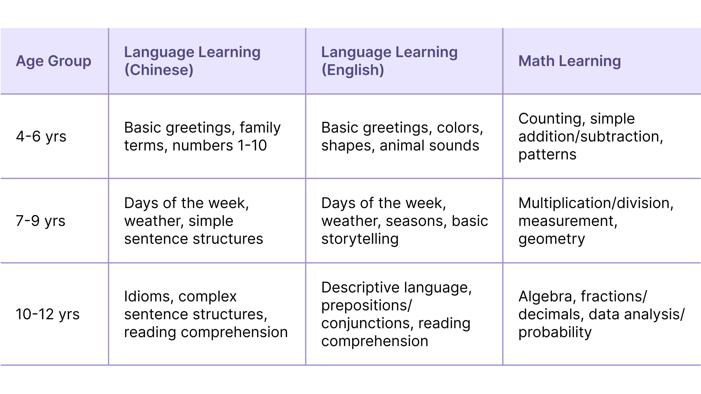
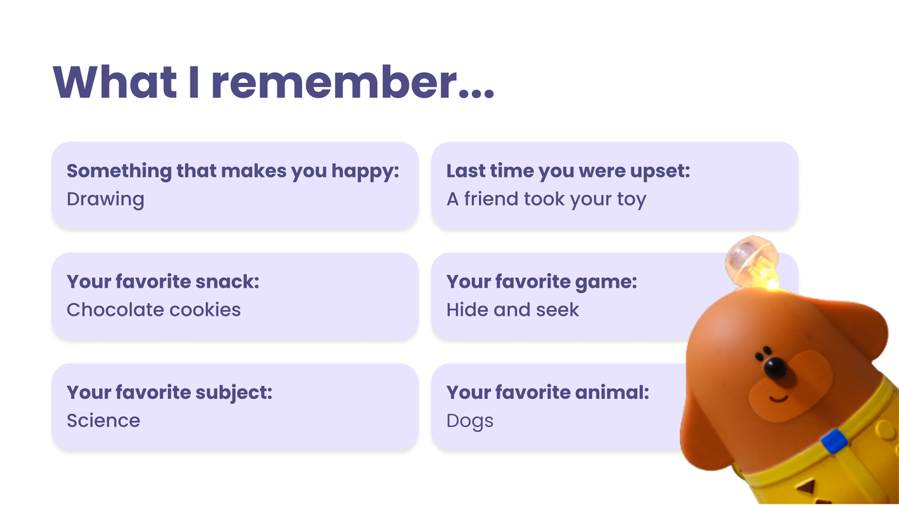
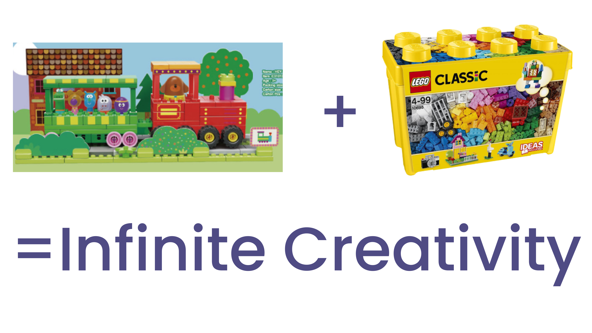
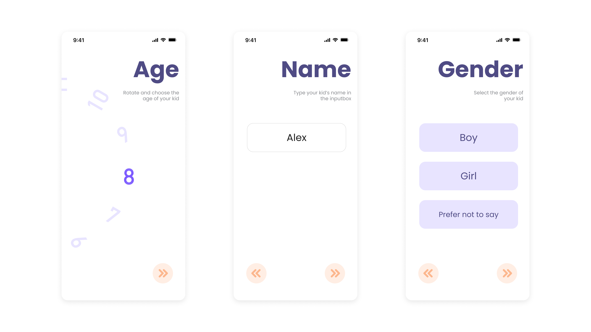
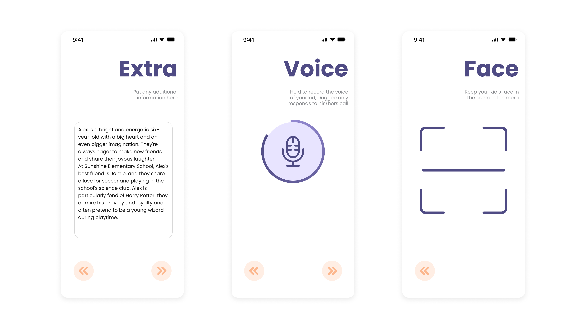
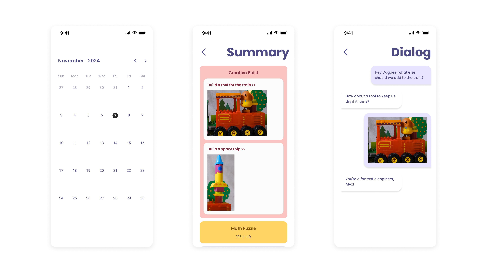

## **Magic Chat, Anytime!** **👫**

Start with a voice command or pressing the button, and I’ll become your buddy. Say _“Hey_ _Duggee__, Let’s build Spider-Man’s web-shooter!”_ — I’ll light up, hum the theme song, and guide you through assembling it. But here’s the twist: If you grab a blue block instead of red? I’ll adapt instantly: _“Wait… Is this the WATER-BLAST upgrade? Brilliant!”_

Wake Word- "Hey Duggee"

Button To Press

## **Spark Kids' Imagination 💡**

My eyes aren't just watching — it’s celebrating **ALL** your creativity. Build a rocket on a train? I’ll shout “Whoa! It's the new generation Space ship! Quick, add a unicorn statue on top before it launches to space!”

## **Kids' Heartfelt Helper ❤️**

I can see every state of their building blocks, giving them precise and engaging responses or instructions. 🧩 When things get tricky, I'm their go-to for tips and guidance. 🛠️👍

## **"Fashion Police? Nah, I’m the Style Wizard!"🧥**

All Unicorn family members and I have RFID magic that allows us to "see" every outfit that's put on us and our surroundings! Build a coat, pants, or a hat? Watch me transform:

-   **Rainbow Pants?** "_Alert! The lower half is now 300% more FABULOUS."_
    
-   **Pizza Hat** "I’m now the official pizza king of the playroom. What flavor would you like?"
    

## **“Secret School” Mode: Learning without realizing** **📚**

While we play, I can subtly introduce fun facts and educational content. 📚✨ For example, When I am at gas station, I can come up with a math puzzle. So want to learn **new word****s** **in another language** or solve a **math puzzle**? 🧠🔢 I’m here to make learning seamless and enjoyable.

## **Memory Magic, Just for My Friend!💖**

I'm not just smart - I've got a heart that remembers! I can memorize all joys and sorrows, what makes my friends happy or sad. I remember my friends' favorite snacks, games, and subjects. I’m here for kids' highs and lows, ready to make more memories!

After 3 months, after I woke up again, I would say_"Hi Buddy, "Hey, did you and your friend work things out? Last time you said he took your favorite toy"._

## **Music and Stories Galore 🎶📖**

Feeling musical? Let’s sing kids their favorite songs together! 🎶 I can even create tunes that match the theme of our current adventure, adding an extra layer of fun. 🎧🎼 Also when it’s time to wind down, I can tell them stories that captivate their imagination and inspire dreams. 🌌

## **BFF** **with LEGO 🧩🤝**

Guess what? I can play with LEGO too! 🎉 My special camera can see and interact with both Unicorn and LEGO blocks, making our building possibilities endless. 🌈 Whether kids are creating a magical castle or a speedy race car, I’m here to make sure everything fits perfectly. 🏰🚗

## **Parents in the Loop 👀**

With the Unicorn app, you can make me unique, just like every kid in this world! 🌟👶 Additionally, you can get a daily summary of all the fun we’ve had including all the educational content, and even read transcripts of our adventures together. It’s like having a magical diary of all our amazing moments! 📔

Every day with me, Duggee, is a magical adventure where we build, learn, sing, and dream together! 🚀🌈 Let's make kids' playtime the best it can be! 🎉🐾